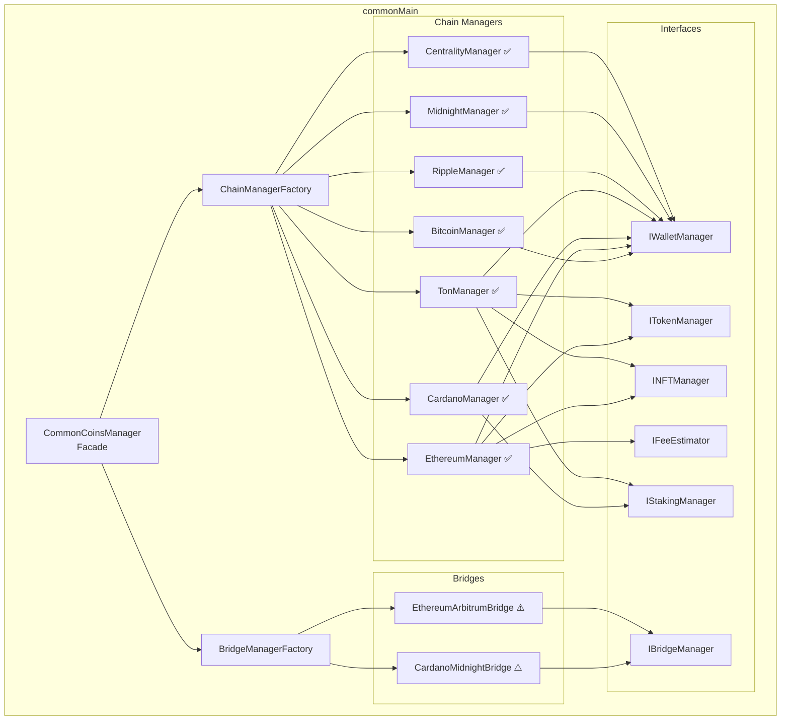
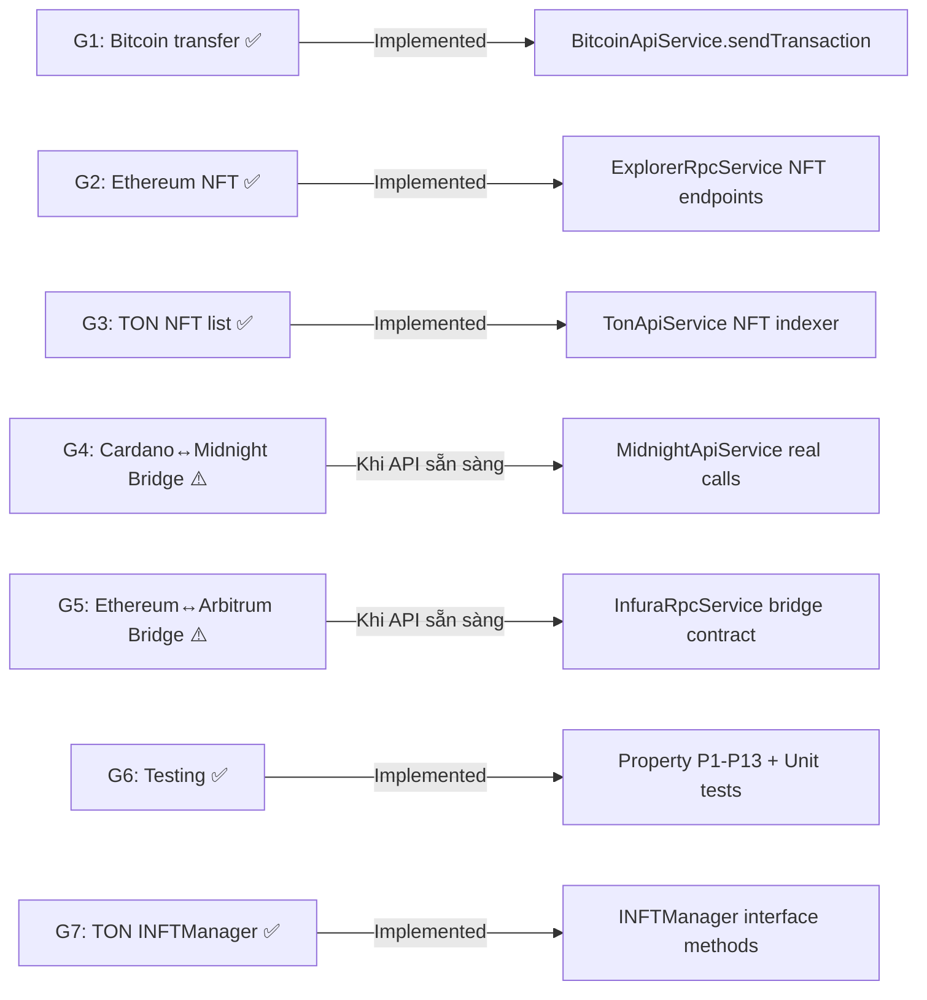
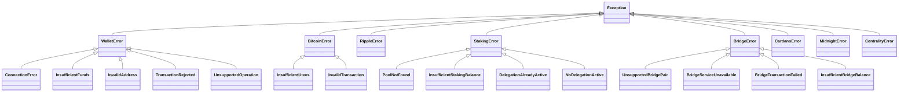

# Tài liệu Thiết kế — Crypto Wallet Module

## Tổng quan (Overview)

Tài liệu thiết kế này tập trung vào các **khoảng trống (gaps)** còn lại trong `crypto-wallet-lib` — một thư viện Kotlin Multiplatform (KMP) hỗ trợ đa blockchain. Kiến trúc và implementation đã hoàn thiện (~98%), bao gồm: HD Wallet (BIP32/39/44), interface hierarchy, factory pattern, facade pattern, CBOR serialization, SCALE encoding, và 7 chain managers. Các gaps G1, G2, G3, G6, G7 đã được hoàn thiện.

### Trạng thái các khoảng trống

| Gap ID | Module | Mô tả | Trạng thái |
|--------|--------|--------|------------|
| G1 | BitcoinManager | `transfer()` broadcast transaction lên network | ✅ Hoàn thiện |
| G2 | EthereumManager | `getNFTs()` và `transferNFT()` ERC-721 operations | ✅ Hoàn thiện |
| G3 | TonManager | `getNFT()` list NFTs qua TonApiService | ✅ Hoàn thiện |
| G4 | CardanoMidnightBridge | Simulated responses — chưa kết nối Midnight API thật | ⚠️ Optional — phụ thuộc API |
| G5 | EthereumArbitrumBridge | Simulated responses — chưa kết nối Arbitrum bridge contract thật | ⚠️ Optional — phụ thuộc API |
| G6 | Testing | Property-based tests (P1-P13) và unit tests cho tất cả modules | ✅ Hoàn thiện |
| G7 | INFTManager trên TonManager | TonManager implement `INFTManager` interface | ✅ Hoàn thiện |

### Quyết định thiết kế chính

1. **Không refactor code đã hoạt động** — Các module ~100% (Cardano, Ripple, Midnight, Centrality) giữ nguyên
2. **Bridge giữ simulated response** cho đến khi API thật sẵn sàng — thiết kế sẵn integration points
3. **Property-based testing** sử dụng Kotest Property — 13 properties đã implement (P1-P13)
4. **G1, G2, G3, G6, G7 đã hoàn thiện** — Bitcoin transfer, Ethereum/TON NFT, testing đầy đủ

## Kiến trúc (Architecture)

### Kiến trúc hiện tại



### Chiến lược hoàn thiện gaps



## Components và Interfaces

### G1: BitcoinManager — `transfer()` ✅

BitcoinManager `transfer()` đã được implement. Gọi `BitcoinApiService.sendTransaction(dataSigned)` để broadcast signed transaction hex lên network, trả về `TransferResponseModel`.

**Thiết kế:**
- `transfer(dataSigned, coinNetwork)` nhận signed transaction hex string
- Gọi `BitcoinApiService.sendTransaction(dataSigned)` để broadcast lên network
- Trả về `TransferResponseModel` với txHash từ response

```kotlin
// BitcoinManager.kt
override suspend fun transfer(
    dataSigned: String,
    coinNetwork: CoinNetwork
): TransferResponseModel {
    return try {
        val txHash = BitcoinApiService.INSTANCE.sendTransaction(dataSigned)
        TransferResponseModel(success = true, error = null, txHash = txHash)
    } catch (e: Exception) {
        TransferResponseModel(success = false, error = e.message, txHash = null)
    }
}
```

**Lý do:** Giữ consistent với pattern của các chain manager khác (EthereumManager, CardanoManager) — nhận pre-signed data, broadcast, trả về result.

### G2: EthereumManager — NFT operations ✅

EthereumManager NFT operations đã được implement. `getNFTs()` gọi ExplorerRpcService endpoint `tokennfttx`, `transferNFT()` broadcast pre-signed ERC-721 transaction qua InfuraRpcService.

**Thiết kế:**
- `getNFTs(address, coinNetwork)` gọi ExplorerRpcService (Etherscan/Arbiscan API) endpoint `tokennfttx` để lấy danh sách NFT
- `transferNFT(nftAddress, toAddress, memo, coinNetwork)` nhận pre-signed ERC-721 transfer data và broadcast qua InfuraRpcService

```kotlin
// EthereumManager.kt — getNFTs
override suspend fun getNFTs(address: String, coinNetwork: CoinNetwork): List<NFTItem>? {
    return try {
        ExplorerRpcService.INSTANCE.getNFTTransactions(coinNetwork, address)
            ?.result
            ?.distinctBy { it.contractAddress to it.tokenID }
            ?.map { NFTItem(/* map fields */) }
    } catch (e: Exception) { null }
}

// transferNFT — broadcast pre-signed ERC-721 safeTransferFrom
override suspend fun transferNFT(
    nftAddress: String, toAddress: String, memo: String?, coinNetwork: CoinNetwork
): TransferResponseModel {
    return try {
        // nftAddress is used as pre-signed transaction data
        val txHash = InfuraRpcService.shared.sendSignedTransaction(coinNetwork, nftAddress)
        TransferResponseModel(success = true, error = null, txHash = txHash)
    } catch (e: Exception) {
        TransferResponseModel(success = false, error = e.message, txHash = null)
    }
}
```

### G3 + G7: TonManager — NFT listing và INFTManager ✅

TonManager đã implement `INFTManager` interface. `getNFTs()` gọi TonApiService, `transferNFT()` delegate sang `signNFTTransfer()` + broadcast qua `sendBoc()`.

**Thiết kế:**
- Thêm `INFTManager` vào class declaration của TonManager
- Implement `getNFTs()` qua TonApiService gọi TON API v2 `/nfts/collections` hoặc indexer
- Implement `transferNFT()` delegate sang `signNFTTransfer()` + broadcast

```kotlin
class TonManager(...) : BaseCoinManager(), ITokenAndNFT, IStakingManager, INFTManager {
    
    override suspend fun getNFTs(address: String, coinNetwork: CoinNetwork): List<NFTItem>? {
        return try {
            TonApiService.INSTANCE.getNFTItems(coinNetwork, address)
                ?.map { NFTItem(/* map TEP-62 fields */) }
        } catch (e: Exception) { null }
    }
    
    override suspend fun transferNFT(
        nftAddress: String, toAddress: String, memo: String?, coinNetwork: CoinNetwork
    ): TransferResponseModel {
        return try {
            val seqno = getSeqno(coinNetwork)
            val boc = signNFTTransfer(nftAddress, toAddress, seqno, memo = memo)
            val result = TonApiService.INSTANCE.sendBoc(coinNetwork, boc)
            TransferResponseModel(
                success = result == "success",
                error = if (result != "success") "NFT transfer failed" else null,
                txHash = if (result == "success") "pending" else null
            )
        } catch (e: Exception) {
            TransferResponseModel(success = false, error = e.message, txHash = null)
        }
    }
}
```

### G4 + G5: Bridge Integration Points

Cả hai bridge implementations (CardanoMidnightBridge, EthereumArbitrumBridge) đã có cấu trúc đầy đủ với simulated responses. Khi API thật sẵn sàng, chỉ cần thay thế các `simulate*()` methods.

**Integration points đã sẵn sàng:**

| Method | CardanoMidnightBridge | EthereumArbitrumBridge |
|--------|----------------------|----------------------|
| Lock/Deposit | `simulateLockTransaction()` → CardanoApiService | `simulateDepositTransaction()` → InfuraRpcService |
| Burn/Withdraw | `simulateBurnTransaction()` → MidnightApiService | `simulateWithdrawalTransaction()` → InfuraRpcService |
| Mint/Unlock | `simulateInitiateMint()` → MidnightApiService | N/A (Arbitrum auto-confirms) |
| Status | `queryBridgeStatusFromService()` → MidnightApiService | `queryTransactionReceiptStatus()` → InfuraRpcService |

**Quyết định:** Không thay đổi bridge code cho đến khi API thật sẵn sàng. Thiết kế hiện tại đã đúng pattern và dễ swap.

### G6: Testing Strategy (chi tiết ở phần Testing Strategy)

## Data Models

### Models hiện có (không thay đổi)

| Model | Mô tả | File |
|-------|--------|------|
| `TransferResponseModel` | Kết quả gửi giao dịch (txHash, success, error) | TransferModel.kt |
| `NFTItem` | Thông tin NFT item | NFTItem.kt |
| `FeeEstimate` / `GasPrice` | Fee estimation results | FeeEstimate.kt |
| `BridgeFeeEstimate` / `BridgeStatus` | Bridge fee và status | BridgeModels.kt |
| `TonStakingBalance` | TON staking balance info | ton/models |
| `WalletError` / `StakingError` / `BridgeError` | Error hierarchy | WalletError.kt |

### Models đã bổ sung

**Cho Ethereum NFT (G2) — ✅ Đã implement:**
```kotlin
// Trong ExplorerModel hoặc file riêng
@Serializable
data class NFTTransaction(
    val contractAddress: String,
    val tokenID: String,
    val tokenName: String,
    val tokenSymbol: String,
    val from: String,
    val to: String
)
```

**Cho TON NFT (G3) — ✅ Đã implement:**
```kotlin
// Trong models/ton/
@Serializable
data class TonNFTItem(
    val address: String,
    val collectionAddress: String?,
    val ownerAddress: String,
    val metadata: TonNFTMetadata?
)

@Serializable
data class TonNFTMetadata(
    val name: String?,
    val description: String?,
    val image: String?
)
```

## Correctness Properties

*Một property là một đặc tính hoặc hành vi phải đúng trên mọi lần thực thi hợp lệ của hệ thống — về bản chất là một phát biểu hình thức về những gì hệ thống phải làm. Properties đóng vai trò cầu nối giữa đặc tả đọc được bởi con người và đảm bảo tính đúng đắn có thể kiểm chứng bằng máy.*

### Property 1: BIP39 mnemonic generation tạo đúng số từ

*For any* valid strength value trong tập {128, 160, 192, 224, 256}, khi tạo mnemonic mới, số từ trong mnemonic phải bằng `(strength / 32) * 3` (tức 12, 15, 18, 21, 24 từ tương ứng), và mnemonic phải pass validation của BIP39.

**Validates: Requirements 2.1, 2.2**

### Property 2: BIP39 mnemonic → seed determinism

*For any* valid mnemonic và bất kỳ passphrase nào, gọi `deterministicSeedString(mnemonic, passphrase)` hai lần liên tiếp phải trả về cùng một seed hex string. Ngoài ra, validate mnemonic rồi tạo lại mnemonic từ entropy phải tạo ra mnemonic tương đương.

**Validates: Requirements 2.3, 2.6**

### Property 3: BIP32 key derivation determinism và validity

*For any* valid seed bytes và derivation path hợp lệ, key derivation phải tạo ra private key (32 bytes) và public key (33 bytes compressed cho Secp256k1, 32 bytes cho Ed25519). Gọi derivation hai lần với cùng input phải tạo ra cùng key pair byte-for-byte.

**Validates: Requirements 3.1, 3.6**

### Property 4: Address format validity cho tất cả coin types

*For any* valid mnemonic và *for any* NetworkName trong enum, address được tạo phải khớp format regex tương ứng: Bitcoin (bc1... hoặc tb1...), Ethereum (0x + 40 hex chars), Cardano (addr1... hoặc addr_test1...), TON (Base64url), Midnight (midnight1...), Ripple (r...), Centrality (cX...). Address không được rỗng.

**Validates: Requirements 4.1, 4.2, 4.3, 4.4, 4.5, 4.6, 4.7**

### Property 5: Address generation determinism

*For any* valid mnemonic và *for any* coin type, gọi `getAddress()` hai lần trên cùng một manager instance phải trả về cùng một address string.

**Validates: Requirements 4.8**

### Property 6: CBOR serialization round-trip

*For any* valid CBOR value (unsigned integer, negative integer, byte string, text string, array, map, tag), `CborDecoder.decode(CborEncoder.encode(value))` phải tạo ra giá trị tương đương với giá trị gốc.

**Validates: Requirements 9.4**

### Property 7: Cardano transaction CBOR round-trip

*For any* valid Shelley transaction (với inputs, outputs, fee, ttl hợp lệ), serialize transaction thành CBOR bytes rồi deserialize lại phải tạo ra transaction có cùng inputs, outputs, fee, và ttl.

**Validates: Requirements 14.6**

### Property 8: SCALE encoding round-trip

*For any* valid non-negative BigInteger value, `ScaleCodec.decodeCompact(ScaleCodec.encodeCompact(value))` phải tạo ra giá trị tương đương với giá trị gốc. Điều này phải đúng cho cả 4 mode: single-byte (≤63), two-byte (≤16383), four-byte (≤1073741823), và big-integer mode.

**Validates: Requirements 24.5**

### Property 9: SS58 address round-trip

*For any* valid SS58 address string, parsing ra public key rồi re-encoding lại SS58 phải tạo ra cùng public key bytes. Tức là `SS58.encode(SS58.parse(address).publicKey)` phải chứa cùng public key với address gốc.

**Validates: Requirements 25.4**

### Property 10: Cardano address validation

*For any* valid Byron address (Base58 + CBOR + CRC32) và *for any* valid Shelley address (Bech32 + addr/addr_test prefix), hàm validation phải trả về `true`. *For any* random string không phải address hợp lệ, hàm validation phải trả về `false` hoặc throw error mô tả rõ nguyên nhân.

**Validates: Requirements 12.2, 13.3**

### Property 11: Capability matrix consistency

*For any* NetworkName value, các capability check methods phải nhất quán với capability matrix:
- `supportsTokens(coin)` trả về `true` chỉ khi coin ∈ {ETHEREUM, ARBITRUM, CARDANO, TON}
- `supportsNFTs(coin)` trả về `true` chỉ khi coin ∈ {ETHEREUM, ARBITRUM, TON}
- `supportsFeeEstimation(coin)` trả về `true` chỉ khi coin ∈ {ETHEREUM, ARBITRUM}
- `supportsStaking(coin)` trả về `true` chỉ khi coin ∈ {CARDANO, TON}
- `ChainManagerFactory.createWalletManager(coin, mnemonic)` trả về non-null cho mọi NetworkName
- `ChainManagerFactory.createStakingManager(coin, mnemonic)` trả về `null` khi coin ∉ {CARDANO, TON}
- `supportsBridge(from, to)` trả về `true` chỉ cho các cặp: Cardano↔Midnight, Ethereum↔Arbitrum

**Validates: Requirements 5.7, 6.1, 6.7, 6.8, 7.7, 7.8, 30.2, 30.5, 34.1, 34.2, 34.3, 34.4, 34.5, 34.6, 34.7, 34.8**

### Property 12: Bridge status là giá trị hợp lệ

*For any* bridge transaction hash (non-blank string), `getBridgeStatus(txHash)` phải trả về một trong các giá trị: "pending", "confirming", "completed", hoặc "failed".

**Validates: Requirements 29.2**

### Property 13: ACTCoin metadata consistency

*For any* ACTCoin enum value, các metadata methods (nameCoin, symbolName, minimumValue, unitValue, regex, algorithm, feeDefault) phải trả về giá trị non-null và nhất quán. `unitValue` phải > 0, `minimumValue` phải ≥ 0, `regex` phải là valid regex pattern.

**Validates: Requirements 8.1, 8.2, 8.3, 8.4, 8.5**

## Error Handling

### Error Hierarchy hiện tại (đã implement đầy đủ)



### Chiến lược Error Handling cho Gaps

**G1 (Bitcoin transfer):**
- Network errors → `WalletError.ConnectionError`
- Invalid transaction data → `BitcoinError.InvalidTransaction`
- API rejection → `WalletError.TransactionRejected`

**G2 (Ethereum NFT):**
- NFT not found → trả về `emptyList()` (không throw)
- Transfer failure → `TransferResponseModel(success=false, error=message)`
- Network errors → `WalletError.ConnectionError`

**G3 (TON NFT):**
- NFT listing failure → trả về `null` (consistent với pattern hiện tại)
- Transfer failure → `TransferResponseModel(success=false, error=message)`

**Nguyên tắc chung:**
- CommonCoinsManager luôn catch exceptions và wrap thành result objects (`BalanceResult`, `SendResult`)
- Chain managers có thể throw specific errors
- Bridge managers throw `BridgeError` subclasses
- Tất cả error messages chứa thông tin chi tiết (endpoint, amounts, reasons)

## Testing Strategy

### Dual Testing Approach

Thư viện sử dụng kết hợp **unit tests** và **property-based tests** trong `commonTest` source set, chạy trên cả 3 platform (Android, iOS, JVM).

### Property-Based Testing

- **Library:** `io.kotest:kotest-property` (đã có trong commonTest dependencies)
- **Minimum iterations:** 100 per property test
- **Tag format:** Comment `// Feature: crypto-wallet-module, Property {N}: {title}`
- **Mỗi correctness property** được implement bởi **một property-based test duy nhất**

### Unit Tests

Unit tests tập trung vào:
- **Known test vectors:** BIP39/BIP32 standard test vectors (RFC, SLIP-0010)
- **Edge cases:** Empty mnemonic, invalid addresses, zero amounts, max values
- **Error conditions:** Network errors (Ktor mock), insufficient funds, invalid transactions
- **Integration points:** CommonCoinsManager delegation, ChainManagerFactory creation
- **Staking/Bridge:** Mock API responses cho staking operations và bridge flows

### Test Plan theo Gap

| Gap | Property Tests | Unit Tests | Trạng thái |
|-----|---------------|------------|------------|
| G1: Bitcoin transfer | — | Mock BitcoinApiService, test success/failure paths | ✅ |
| G2: Ethereum NFT | — | Mock ExplorerRpcService NFT endpoint, test mapping | ✅ |
| G3: TON NFT | — | Mock TonApiService NFT endpoint, test mapping | ✅ |
| G6: Core testing | P1-P13 (tất cả properties) | BIP39 vectors, CBOR edge cases, address validation | ✅ |

### Cấu trúc Test Files

```
commonTest/kotlin/
├── property/
│   ├── BIP39PropertyTest.kt          // P1, P2
│   ├── BIP32PropertyTest.kt          // P3
│   ├── AddressPropertyTest.kt        // P4, P5, P10
│   ├── CborPropertyTest.kt           // P6, P7
│   ├── ScalePropertyTest.kt          // P8
│   ├── SS58PropertyTest.kt           // P9
│   ├── CapabilityMatrixPropertyTest.kt // P11, P12, P13
│   └── ACTCoinPropertyTest.kt        // P13 (metadata)
├── unit/
│   ├── BitcoinManagerTest.kt         // G1 + existing
│   ├── EthereumNFTTest.kt            // G2
│   ├── TonNFTTest.kt                 // G3
│   ├── BridgeTest.kt                 // G4, G5 (simulated)
│   ├── StakingTest.kt                // Cardano + TON staking
│   ├── ErrorHandlingTest.kt          // Error hierarchy
│   └── CommonCoinsManagerTest.kt     // Facade delegation
└── MnemonicTest.kt                   // Existing
```

### Ktor Mock Client Pattern

Tất cả unit tests sử dụng `ktor-client-mock` để mock network responses:

```kotlin
val mockEngine = MockEngine { request ->
    when {
        request.url.encodedPath.contains("balance") ->
            respond(content = """{"balance": "1000000"}""", headers = headersOf("Content-Type", "application/json"))
        else -> respondError(HttpStatusCode.NotFound)
    }
}
```

### Property Test Configuration

```kotlin
// Ví dụ property test với Kotest
class CborPropertyTest {
    @Test
    fun cborRoundTrip() = runTest {
        // Feature: crypto-wallet-module, Property 6: CBOR serialization round-trip
        checkAll(100, Arb.cborValue()) { value ->
            val encoded = CborEncoder.encode(value)
            val decoded = CborDecoder.decode(encoded)
            decoded shouldBe value
        }
    }
}
```
