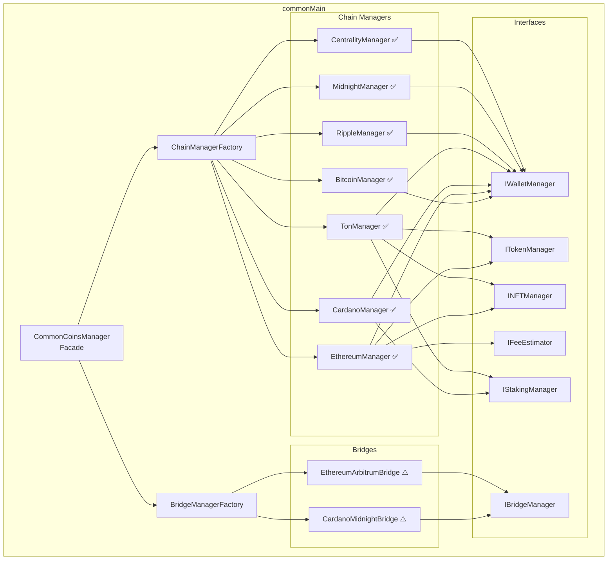
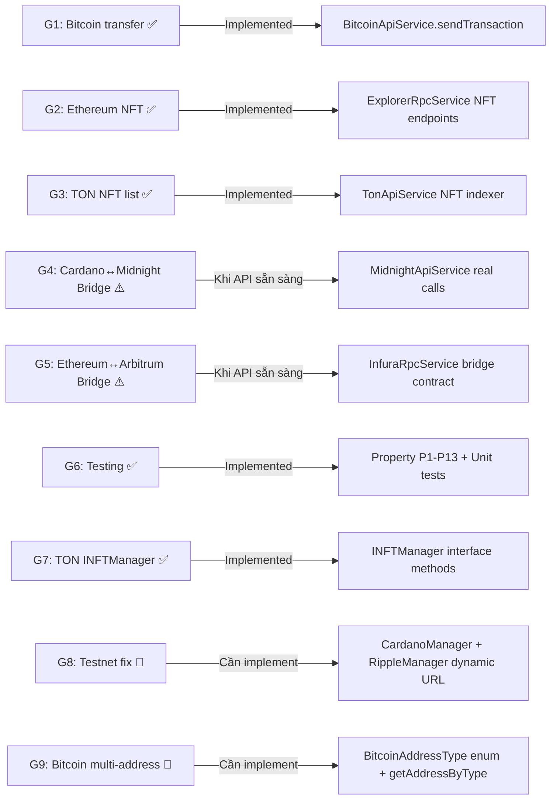

# Tài liệu Thiết kế — Crypto Wallet Module

## Tổng quan (Overview)

Tài liệu thiết kế này tập trung vào các **khoảng trống (gaps)** còn lại trong `crypto-wallet-lib` — một thư viện Kotlin Multiplatform (KMP) hỗ trợ đa blockchain. Kiến trúc và implementation đã hoàn thiện (~98%), bao gồm: HD Wallet (BIP32/39/44), interface hierarchy, factory pattern, facade pattern, CBOR serialization, SCALE encoding, và 7 chain managers. Các gaps G1, G2, G3, G6, G7 đã được hoàn thiện. G8 (Testnet support) và G9 (Bitcoin multi-address type) là gaps mới cần triển khai.

### Trạng thái các khoảng trống

| Gap ID | Module | Mô tả | Trạng thái |
|--------|--------|--------|------------|
| G1 | BitcoinManager | `transfer()` broadcast transaction lên network | ✅ Hoàn thiện |
| G2 | EthereumManager | `getNFTs()` và `transferNFT()` ERC-721 operations | ✅ Hoàn thiện |
| G3 | TonManager | `getNFT()` list NFTs qua TonApiService | ✅ Hoàn thiện |
| G4 | CardanoMidnightBridge | Simulated responses — chưa kết nối Midnight API thật | ⚠️ Optional — phụ thuộc API |
| G5 | EthereumArbitrumBridge | Simulated responses — chưa kết nối Arbitrum bridge contract thật | ⚠️ Optional — phụ thuộc API |
| G6 | Testing | Property-based tests (P1-P13) và unit tests cho tất cả modules | ✅ Hoàn thiện |
| G7 | INFTManager trên TonManager | TonManager implement `INFTManager` interface | ✅ Hoàn thiện |
| G8 | CardanoManager, RippleManager | Testnet support — fix hardcoded mainnet URLs | 🔲 Chưa implement |
| G9 | BitcoinManager | Multi-address type (Native SegWit, Nested SegWit, Legacy) + HD multi-account | 🔲 Chưa implement |

### Quyết định thiết kế chính

1. **Không refactor code đã hoạt động** — Các module ~100% (Midnight, Centrality) giữ nguyên
2. **Bridge giữ simulated response** cho đến khi API thật sẵn sàng — thiết kế sẵn integration points
3. **Property-based testing** sử dụng Kotest Property — 13 properties đã implement (P1-P13), bổ sung P14-P18 cho G8/G9
4. **G1, G2, G3, G6, G7 đã hoàn thiện** — Bitcoin transfer, Ethereum/TON NFT, testing đầy đủ
5. **G8: Testnet fix** — CardanoManager và RippleManager cần đọc network config động thay vì hardcode mainnet
6. **G9: Bitcoin multi-address** — Thêm `BitcoinAddressType` enum và `getAddressByType()` API, fix `getLegacyAddress()` và `getSegWitAddress()` đang dùng sai hàm `computeBIP84Address()`

## Kiến trúc (Architecture)

### Kiến trúc hiện tại



### Chiến lược hoàn thiện gaps



## Components và Interfaces

### G1: BitcoinManager — `transfer()` ✅

BitcoinManager `transfer()` đã được implement. Gọi `BitcoinApiService.sendTransaction(dataSigned)` để broadcast signed transaction hex lên network, trả về `TransferResponseModel`.

**Thiết kế:**
- `transfer(dataSigned, coinNetwork)` nhận signed transaction hex string
- Gọi `BitcoinApiService.sendTransaction(dataSigned)` để broadcast lên network
- Trả về `TransferResponseModel` với txHash từ response

```kotlin
// BitcoinManager.kt
override suspend fun transfer(
    dataSigned: String,
    coinNetwork: CoinNetwork
): TransferResponseModel {
    return try {
        val txHash = BitcoinApiService.INSTANCE.sendTransaction(dataSigned)
        TransferResponseModel(success = true, error = null, txHash = txHash)
    } catch (e: Exception) {
        TransferResponseModel(success = false, error = e.message, txHash = null)
    }
}
```

**Lý do:** Giữ consistent với pattern của các chain manager khác (EthereumManager, CardanoManager) — nhận pre-signed data, broadcast, trả về result.

### G2: EthereumManager — NFT operations ✅

EthereumManager NFT operations đã được implement. `getNFTs()` gọi ExplorerRpcService endpoint `tokennfttx`, `transferNFT()` broadcast pre-signed ERC-721 transaction qua InfuraRpcService.

**Thiết kế:**
- `getNFTs(address, coinNetwork)` gọi ExplorerRpcService (Etherscan/Arbiscan API) endpoint `tokennfttx` để lấy danh sách NFT
- `transferNFT(nftAddress, toAddress, memo, coinNetwork)` nhận pre-signed ERC-721 transfer data và broadcast qua InfuraRpcService

```kotlin
// EthereumManager.kt — getNFTs
override suspend fun getNFTs(address: String, coinNetwork: CoinNetwork): List<NFTItem>? {
    return try {
        ExplorerRpcService.INSTANCE.getNFTTransactions(coinNetwork, address)
            ?.result
            ?.distinctBy { it.contractAddress to it.tokenID }
            ?.map { NFTItem(/* map fields */) }
    } catch (e: Exception) { null }
}

// transferNFT — broadcast pre-signed ERC-721 safeTransferFrom
override suspend fun transferNFT(
    nftAddress: String, toAddress: String, memo: String?, coinNetwork: CoinNetwork
): TransferResponseModel {
    return try {
        // nftAddress is used as pre-signed transaction data
        val txHash = InfuraRpcService.shared.sendSignedTransaction(coinNetwork, nftAddress)
        TransferResponseModel(success = true, error = null, txHash = txHash)
    } catch (e: Exception) {
        TransferResponseModel(success = false, error = e.message, txHash = null)
    }
}
```

### G3 + G7: TonManager — NFT listing và INFTManager ✅

TonManager đã implement `INFTManager` interface. `getNFTs()` gọi TonApiService, `transferNFT()` delegate sang `signNFTTransfer()` + broadcast qua `sendBoc()`.

**Thiết kế:**
- Thêm `INFTManager` vào class declaration của TonManager
- Implement `getNFTs()` qua TonApiService gọi TON API v2 `/nfts/collections` hoặc indexer
- Implement `transferNFT()` delegate sang `signNFTTransfer()` + broadcast

```kotlin
class TonManager(...) : BaseCoinManager(), ITokenAndNFT, IStakingManager, INFTManager {
    
    override suspend fun getNFTs(address: String, coinNetwork: CoinNetwork): List<NFTItem>? {
        return try {
            TonApiService.INSTANCE.getNFTItems(coinNetwork, address)
                ?.map { NFTItem(/* map TEP-62 fields */) }
        } catch (e: Exception) { null }
    }
    
    override suspend fun transferNFT(
        nftAddress: String, toAddress: String, memo: String?, coinNetwork: CoinNetwork
    ): TransferResponseModel {
        return try {
            val seqno = getSeqno(coinNetwork)
            val boc = signNFTTransfer(nftAddress, toAddress, seqno, memo = memo)
            val result = TonApiService.INSTANCE.sendBoc(coinNetwork, boc)
            TransferResponseModel(
                success = result == "success",
                error = if (result != "success") "NFT transfer failed" else null,
                txHash = if (result == "success") "pending" else null
            )
        } catch (e: Exception) {
            TransferResponseModel(success = false, error = e.message, txHash = null)
        }
    }
}
```

### G4 + G5: Bridge Integration Points

Cả hai bridge implementations (CardanoMidnightBridge, EthereumArbitrumBridge) đã có cấu trúc đầy đủ với simulated responses. Khi API thật sẵn sàng, chỉ cần thay thế các `simulate*()` methods.

**Integration points đã sẵn sàng:**

| Method | CardanoMidnightBridge | EthereumArbitrumBridge |
|--------|----------------------|----------------------|
| Lock/Deposit | `simulateLockTransaction()` → CardanoApiService | `simulateDepositTransaction()` → InfuraRpcService |
| Burn/Withdraw | `simulateBurnTransaction()` → MidnightApiService | `simulateWithdrawalTransaction()` → InfuraRpcService |
| Mint/Unlock | `simulateInitiateMint()` → MidnightApiService | N/A (Arbitrum auto-confirms) |
| Status | `queryBridgeStatusFromService()` → MidnightApiService | `queryTransactionReceiptStatus()` → InfuraRpcService |

**Quyết định:** Không thay đổi bridge code cho đến khi API thật sẵn sàng. Thiết kế hiện tại đã đúng pattern và dễ swap.

### G8: Testnet Support — Fix CardanoManager và RippleManager

#### Phân tích vấn đề

**CardanoManager** — Constructor hardcode mainnet URL:
```kotlin
// HIỆN TẠI (bug):
class CardanoManager(
    private val mnemonic: String,
    private val apiService: CardanoApiService = CardanoApiService(
        baseUrl = "https://cardano-mainnet.blockfrost.io/api/v0"  // ← hardcoded mainnet
    )
)
```

`CoinNetwork.getBlockfrostUrl()` đã hỗ trợ cả mainnet và testnet (preprod), nhưng CardanoManager không sử dụng nó khi tạo default `apiService`.

**RippleManager** — Hardcode `isTestNet=false`:
```kotlin
// HIỆN TẠI (bug):
class RippleManager(
    mnemonic: String,
    private val apiService: RippleApiService = RippleApiService.INSTANCE
) : BaseCoinManager(), IWalletManager {
    private val network = ACTNetwork(ACTCoin.Ripple, false)  // ← hardcoded false
    ...
}
```

`ACTNetwork.coinType()` trả về `144` cho Ripple bất kể testnet hay không, nhưng `isTestNet` ảnh hưởng đến `pubkeyhash()`, `publicKeyPrefix()`, và `explorer()`. Ngoài ra, `RippleApiService` cần sử dụng URL từ `CoinNetwork.getRippleRpcUrl()` thay vì hardcode.

#### Thiết kế giải pháp

**CardanoManager fix:**

```kotlin
// SỬA:
class CardanoManager(
    private val mnemonic: String,
    private val apiService: CardanoApiService = CardanoApiService(
        baseUrl = CoinNetwork(NetworkName.CARDANO).getBlockfrostUrl()  // ← dynamic
    )
)
```

Thay đổi duy nhất: default value của `apiService` parameter đọc URL từ `CoinNetwork.getBlockfrostUrl()` thay vì hardcode string. Khi `Config.shared.getNetwork()` là `TESTNET`, URL sẽ tự động là `https://cardano-preprod.blockfrost.io/api/v0`.

**Lưu ý:** `ChainManagerFactory.createWalletManager()` cho CARDANO đã sử dụng `ChainConfig.default(coin)` → `coinNetwork.getBlockfrostUrl()`, nên factory path đã đúng. Fix này chỉ ảnh hưởng khi `CardanoManager` được tạo trực tiếp (không qua factory).

**RippleManager fix:**

```kotlin
// SỬA:
class RippleManager(
    mnemonic: String,
    private val apiService: RippleApiService = RippleApiService.INSTANCE
) : BaseCoinManager(), IWalletManager {
    private val network = ACTNetwork(
        ACTCoin.Ripple,
        Config.shared.getNetwork() == Network.TESTNET  // ← dynamic
    )
    ...
}
```

Thay đổi: `isTestNet` đọc từ `Config.shared.getNetwork()` thay vì hardcode `false`.

**RippleApiService** cũng cần hỗ trợ dynamic URL. Hiện tại `RippleApiService.INSTANCE` có thể đang hardcode mainnet URL. Cần đảm bảo nó sử dụng `CoinNetwork(NetworkName.XRP).getRippleRpcUrl()` để chọn đúng endpoint (`s1.ripple.com` cho mainnet, `s.altnet.rippletest.net` cho testnet).

#### Tác động

- **CardanoManager:** Chỉ thay đổi default parameter value — backward compatible hoàn toàn
- **RippleManager:** Thay đổi initialization logic — cần verify address generation vẫn đúng cho mainnet
- **ChainManagerFactory:** Không cần thay đổi (đã đúng cho Cardano)
- **CoinNetwork:** Không cần thay đổi (đã có `getBlockfrostUrl()` và `getRippleRpcUrl()`)

### G9: BitcoinManager — Multi-Address Type Support

#### Phân tích vấn đề hiện tại

BitcoinManager hiện có 3 methods tạo address nhưng có bugs:

1. **`getLegacyAddress()`** — Dùng `Bitcoin.computeBIP84Address()` (BIP-84 = Native SegWit) thay vì `Bitcoin.computeP2pkhAddress()` (BIP-44 = Legacy P2PKH). Derivation path `m/44'/...` đúng nhưng hàm tạo address sai.
2. **`getSegWitAddress()`** (Nested SegWit) — Cũng dùng `Bitcoin.computeBIP84Address()` thay vì `Bitcoin.computeP2shOfP2wpkhAddress()` (BIP-49 = P2SH-P2WPKH). Derivation path `m/49'/...` đúng nhưng hàm tạo address sai.
3. **`getNativeSegWitAddress()`** — Đúng: dùng `Bitcoin.computeBIP84Address()` với path `m/84'/...`.
4. **Không có `getAddressByType()` API** — Caller phải biết gọi method nào.
5. **Chỉ `getNativeSegWitAddress()` hỗ trợ `numberAccount` parameter** — Legacy và Nested SegWit hardcode account 0.

#### Thiết kế giải pháp

**1. Enum `BitcoinAddressType`:**

```kotlin
// File: crypto-wallet-lib/src/commonMain/kotlin/com/lybia/cryptowallet/wallets/bitcoin/BitcoinAddressType.kt
enum class BitcoinAddressType {
    NATIVE_SEGWIT,   // BIP-84, P2WPKH, prefix bc1/tb1
    NESTED_SEGWIT,   // BIP-49, P2SH-P2WPKH, prefix 3/2
    LEGACY           // BIP-44, P2PKH, prefix 1/m/n
}
```

**2. Unified `getAddressByType()` API:**

```kotlin
// BitcoinManager.kt
fun getAddressByType(
    addressType: BitcoinAddressType = BitcoinAddressType.NATIVE_SEGWIT,
    accountIndex: Int = 0
): String {
    require(accountIndex >= 0) { "Account index phải là số không âm, nhận được: $accountIndex" }

    val isMainnet = Config.shared.getNetwork() == Network.MAINNET
    val coinType = if (isMainnet) 0 else 1
    val chain = if (isMainnet) Chain.Mainnet else Chain.Testnet4

    val (purpose, computeAddress) = when (addressType) {
        BitcoinAddressType.NATIVE_SEGWIT -> 84 to { pubKey: PublicKey ->
            Bitcoin.computeBIP84Address(pubKey, chain.chainHash)
        }
        BitcoinAddressType.NESTED_SEGWIT -> 49 to { pubKey: PublicKey ->
            Bitcoin.computeP2shOfP2wpkhAddress(pubKey, chain.chainHash)
        }
        BitcoinAddressType.LEGACY -> 44 to { pubKey: PublicKey ->
            Bitcoin.computeP2pkhAddress(pubKey, chain.chainHash)
        }
    }

    val path = KeyPath("m/${purpose}'/${coinType}'/${accountIndex}'/0/0")
    val derived = DeterministicWallet.derivePrivateKey(master, path)
    val address = computeAddress(derived.publicKey)

    // Cập nhật state nội bộ
    walletAddress = address
    keyPath = path
    return address
}
```

**3. Fix các methods hiện có:**

```kotlin
// getLegacyAddress — fix dùng computeP2pkhAddress
fun getLegacyAddress(accountIndex: Int = 0): String {
    return getAddressByType(BitcoinAddressType.LEGACY, accountIndex)
}

// getSegWitAddress → getNestedSegWitAddress — fix dùng computeP2shOfP2wpkhAddress
fun getNestedSegWitAddress(accountIndex: Int = 0): String {
    return getAddressByType(BitcoinAddressType.NESTED_SEGWIT, accountIndex)
}

// getNativeSegWitAddress — delegate sang getAddressByType
fun getNativeSegWitAddress(numberAccount: Int = 0): String {
    return getAddressByType(BitcoinAddressType.NATIVE_SEGWIT, numberAccount)
}

// getAddress() mặc định Native SegWit
override fun getAddress(): String {
    if (walletAddress == null) {
        getAddressByType(BitcoinAddressType.NATIVE_SEGWIT, 0)
    }
    return walletAddress ?: ""
}
```

**4. Giữ backward compatibility:**
- `getSegWitAddress()` deprecated, delegate sang `getNestedSegWitAddress()`
- `getNativeSegWitAddress(numberAccount)` giữ nguyên signature, delegate sang `getAddressByType()`
- `getLegacyAddress()` giữ nguyên signature, thêm `accountIndex` parameter

#### Address Format Reference

| Type | BIP | Purpose | Mainnet Prefix | Testnet Prefix | bitcoin-kmp Function |
|------|-----|---------|---------------|----------------|---------------------|
| Native SegWit | 84 | P2WPKH | `bc1q...` | `tb1q...` | `Bitcoin.computeBIP84Address()` |
| Nested SegWit | 49 | P2SH-P2WPKH | `3...` | `2...` | `Bitcoin.computeP2shOfP2wpkhAddress()` |
| Legacy | 44 | P2PKH | `1...` | `m...` / `n...` | `Bitcoin.computeP2pkhAddress()` |

#### Derivation Path Structure

```
m / purpose' / coin_type' / account' / change / address_index
     84/49/44    0(main)/1(test)   0,1,2...    0(ext)/1(int)   0
```

### G6: Testing Strategy (chi tiết ở phần Testing Strategy)

## Data Models

### Models hiện có (không thay đổi)

| Model | Mô tả | File |
|-------|--------|------|
| `TransferResponseModel` | Kết quả gửi giao dịch (txHash, success, error) | TransferModel.kt |
| `NFTItem` | Thông tin NFT item | NFTItem.kt |
| `FeeEstimate` / `GasPrice` | Fee estimation results | FeeEstimate.kt |
| `BridgeFeeEstimate` / `BridgeStatus` | Bridge fee và status | BridgeModels.kt |
| `TonStakingBalance` | TON staking balance info | ton/models |
| `WalletError` / `StakingError` / `BridgeError` | Error hierarchy | WalletError.kt |

### Models đã bổ sung

**Cho Ethereum NFT (G2) — ✅ Đã implement:**
```kotlin
// Trong ExplorerModel hoặc file riêng
@Serializable
data class NFTTransaction(
    val contractAddress: String,
    val tokenID: String,
    val tokenName: String,
    val tokenSymbol: String,
    val from: String,
    val to: String
)
```

**Cho TON NFT (G3) — ✅ Đã implement:**
```kotlin
// Trong models/ton/
@Serializable
data class TonNFTItem(
    val address: String,
    val collectionAddress: String?,
    val ownerAddress: String,
    val metadata: TonNFTMetadata?
)

@Serializable
data class TonNFTMetadata(
    val name: String?,
    val description: String?,
    val image: String?
)
```

**Cho Bitcoin Multi-Address Type (G9) — 🔲 Cần implement:**
```kotlin
// File: crypto-wallet-lib/src/commonMain/kotlin/com/lybia/cryptowallet/wallets/bitcoin/BitcoinAddressType.kt
enum class BitcoinAddressType {
    /** BIP-84, P2WPKH, Bech32 — prefix bc1 (mainnet) / tb1 (testnet) */
    NATIVE_SEGWIT,
    /** BIP-49, P2SH-P2WPKH — prefix 3 (mainnet) / 2 (testnet) */
    NESTED_SEGWIT,
    /** BIP-44, P2PKH — prefix 1 (mainnet) / m,n (testnet) */
    LEGACY
}
```

## Correctness Properties

*Một property là một đặc tính hoặc hành vi phải đúng trên mọi lần thực thi hợp lệ của hệ thống — về bản chất là một phát biểu hình thức về những gì hệ thống phải làm. Properties đóng vai trò cầu nối giữa đặc tả đọc được bởi con người và đảm bảo tính đúng đắn có thể kiểm chứng bằng máy.*

### Property 1: BIP39 mnemonic generation tạo đúng số từ

*For any* valid strength value trong tập {128, 160, 192, 224, 256}, khi tạo mnemonic mới, số từ trong mnemonic phải bằng `(strength / 32) * 3` (tức 12, 15, 18, 21, 24 từ tương ứng), và mnemonic phải pass validation của BIP39.

**Validates: Requirements 2.1, 2.2**

### Property 2: BIP39 mnemonic → seed determinism

*For any* valid mnemonic và bất kỳ passphrase nào, gọi `deterministicSeedString(mnemonic, passphrase)` hai lần liên tiếp phải trả về cùng một seed hex string. Ngoài ra, validate mnemonic rồi tạo lại mnemonic từ entropy phải tạo ra mnemonic tương đương.

**Validates: Requirements 2.3, 2.6**

### Property 3: BIP32 key derivation determinism và validity

*For any* valid seed bytes và derivation path hợp lệ, key derivation phải tạo ra private key (32 bytes) và public key (33 bytes compressed cho Secp256k1, 32 bytes cho Ed25519). Gọi derivation hai lần với cùng input phải tạo ra cùng key pair byte-for-byte.

**Validates: Requirements 3.1, 3.6**

### Property 4: Address format validity cho tất cả coin types

*For any* valid mnemonic và *for any* NetworkName trong enum, address được tạo phải khớp format regex tương ứng: Bitcoin (bc1... hoặc tb1...), Ethereum (0x + 40 hex chars), Cardano (addr1... hoặc addr_test1...), TON (Base64url), Midnight (midnight1...), Ripple (r...), Centrality (cX...). Address không được rỗng.

**Validates: Requirements 4.1, 4.2, 4.3, 4.4, 4.5, 4.6, 4.7**

### Property 5: Address generation determinism

*For any* valid mnemonic và *for any* coin type, gọi `getAddress()` hai lần trên cùng một manager instance phải trả về cùng một address string.

**Validates: Requirements 4.8**

### Property 6: CBOR serialization round-trip

*For any* valid CBOR value (unsigned integer, negative integer, byte string, text string, array, map, tag), `CborDecoder.decode(CborEncoder.encode(value))` phải tạo ra giá trị tương đương với giá trị gốc.

**Validates: Requirements 9.4**

### Property 7: Cardano transaction CBOR round-trip

*For any* valid Shelley transaction (với inputs, outputs, fee, ttl hợp lệ), serialize transaction thành CBOR bytes rồi deserialize lại phải tạo ra transaction có cùng inputs, outputs, fee, và ttl.

**Validates: Requirements 14.6**

### Property 8: SCALE encoding round-trip

*For any* valid non-negative BigInteger value, `ScaleCodec.decodeCompact(ScaleCodec.encodeCompact(value))` phải tạo ra giá trị tương đương với giá trị gốc. Điều này phải đúng cho cả 4 mode: single-byte (≤63), two-byte (≤16383), four-byte (≤1073741823), và big-integer mode.

**Validates: Requirements 24.5**

### Property 9: SS58 address round-trip

*For any* valid SS58 address string, parsing ra public key rồi re-encoding lại SS58 phải tạo ra cùng public key bytes. Tức là `SS58.encode(SS58.parse(address).publicKey)` phải chứa cùng public key với address gốc.

**Validates: Requirements 25.4**

### Property 10: Cardano address validation

*For any* valid Byron address (Base58 + CBOR + CRC32) và *for any* valid Shelley address (Bech32 + addr/addr_test prefix), hàm validation phải trả về `true`. *For any* random string không phải address hợp lệ, hàm validation phải trả về `false` hoặc throw error mô tả rõ nguyên nhân.

**Validates: Requirements 12.2, 13.3**

### Property 11: Capability matrix consistency

*For any* NetworkName value, các capability check methods phải nhất quán với capability matrix:
- `supportsTokens(coin)` trả về `true` chỉ khi coin ∈ {ETHEREUM, ARBITRUM, CARDANO, TON}
- `supportsNFTs(coin)` trả về `true` chỉ khi coin ∈ {ETHEREUM, ARBITRUM, TON}
- `supportsFeeEstimation(coin)` trả về `true` chỉ khi coin ∈ {ETHEREUM, ARBITRUM}
- `supportsStaking(coin)` trả về `true` chỉ khi coin ∈ {CARDANO, TON}
- `ChainManagerFactory.createWalletManager(coin, mnemonic)` trả về non-null cho mọi NetworkName
- `ChainManagerFactory.createStakingManager(coin, mnemonic)` trả về `null` khi coin ∉ {CARDANO, TON}
- `supportsBridge(from, to)` trả về `true` chỉ cho các cặp: Cardano↔Midnight, Ethereum↔Arbitrum

**Validates: Requirements 5.7, 6.1, 6.7, 6.8, 7.7, 7.8, 30.2, 30.5, 34.1, 34.2, 34.3, 34.4, 34.5, 34.6, 34.7, 34.8**

### Property 12: Bridge status là giá trị hợp lệ

*For any* bridge transaction hash (non-blank string), `getBridgeStatus(txHash)` phải trả về một trong các giá trị: "pending", "confirming", "completed", hoặc "failed".

**Validates: Requirements 29.2**

### Property 13: ACTCoin metadata consistency

*For any* ACTCoin enum value, các metadata methods (nameCoin, symbolName, minimumValue, unitValue, regex, algorithm, feeDefault) phải trả về giá trị non-null và nhất quán. `unitValue` phải > 0, `minimumValue` phải ≥ 0, `regex` phải là valid regex pattern.

**Validates: Requirements 8.1, 8.2, 8.3, 8.4, 8.5**

### Property 14: Testnet address và URL correctness cho tất cả chain

*For any* valid mnemonic và *for any* network config (MAINNET hoặc TESTNET), khi tạo address cho 5 chain chính (Bitcoin, Ethereum, Cardano, Ripple, TON):
- Bitcoin TESTNET: address phải có prefix `tb1` (Native SegWit) hoặc `2` (Nested SegWit) hoặc `m`/`n` (Legacy)
- Cardano TESTNET: address phải có prefix `addr_test`
- CoinNetwork phải trả về URL không rỗng cho tất cả 5 chain khi ở TESTNET
- CardanoManager phải sử dụng Blockfrost preprod URL khi TESTNET
- RippleManager phải sử dụng Ripple testnet endpoint khi TESTNET

**Validates: Requirements 35.1, 35.2, 35.3, 35.4, 35.5, 35.6, 35.7, 35.8**

### Property 15: Network switching tạo address khác nhau

*For any* valid mnemonic, khi chuyển đổi giữa MAINNET và TESTNET, address được tạo cho Bitcoin và Cardano phải khác nhau (vì prefix khác nhau). Cụ thể: Bitcoin mainnet address (prefix `bc1`) ≠ Bitcoin testnet address (prefix `tb1`), và Cardano mainnet address (prefix `addr1`) ≠ Cardano testnet address (prefix `addr_test1`).

**Validates: Requirements 35.9**

### Property 16: Bitcoin address type prefix correctness

*For any* valid mnemonic, *for any* `BitcoinAddressType` value, và *for any* valid account index (≥ 0), `getAddressByType(addressType, accountIndex)` phải trả về address có prefix đúng:
- `NATIVE_SEGWIT` + MAINNET → prefix `bc1`
- `NATIVE_SEGWIT` + TESTNET → prefix `tb1`
- `NESTED_SEGWIT` + MAINNET → prefix `3`
- `NESTED_SEGWIT` + TESTNET → prefix `2`
- `LEGACY` + MAINNET → prefix `1`
- `LEGACY` + TESTNET → prefix `m` hoặc `n`

**Validates: Requirements 36.1, 36.2, 36.3, 36.10**

### Property 17: Bitcoin multi-account uniqueness

*For any* valid mnemonic, *for any* `BitcoinAddressType`, và *for any* hai account index khác nhau (i ≠ j, i ≥ 0, j ≥ 0), `getAddressByType(type, i)` ≠ `getAddressByType(type, j)`. Tức là mỗi account index tạo ra address duy nhất.

**Validates: Requirements 36.4, 36.5**

### Property 18: Bitcoin address generation determinism across types

*For any* valid mnemonic, *for any* `BitcoinAddressType`, và *for any* valid account index, gọi `getAddressByType(type, accountIndex)` hai lần liên tiếp phải trả về cùng một address string.

**Validates: Requirements 36.9**

## Error Handling

### Error Hierarchy hiện tại (đã implement đầy đủ)


### Chiến lược Error Handling cho Gaps

**G1 (Bitcoin transfer):**
- Network errors → `WalletError.ConnectionError`
- Invalid transaction data → `BitcoinError.InvalidTransaction`
- API rejection → `WalletError.TransactionRejected`

**G2 (Ethereum NFT):**
- NFT not found → trả về `emptyList()` (không throw)
- Transfer failure → `TransferResponseModel(success=false, error=message)`
- Network errors → `WalletError.ConnectionError`

**G3 (TON NFT):**
- NFT listing failure → trả về `null` (consistent với pattern hiện tại)
- Transfer failure → `TransferResponseModel(success=false, error=message)`

**G8 (Testnet support):**
- CardanoManager với testnet URL không khả dụng → `WalletError.ConnectionError` (giống mainnet)
- RippleManager với testnet endpoint không khả dụng → `WalletError.ConnectionError`
- Không có error mới — chỉ thay đổi URL source

**G9 (Bitcoin multi-address type):**
- Account index âm → `IllegalArgumentException("Account index phải là số không âm")`
- Invalid address type → Không xảy ra (enum type-safe)
- Key derivation failure → `BitcoinError.InvalidTransaction` (propagate từ bitcoin-kmp)

**Nguyên tắc chung:**
- CommonCoinsManager luôn catch exceptions và wrap thành result objects (`BalanceResult`, `SendResult`)
- Chain managers có thể throw specific errors
- Bridge managers throw `BridgeError` subclasses
- Tất cả error messages chứa thông tin chi tiết (endpoint, amounts, reasons)

## Testing Strategy

### Dual Testing Approach

Thư viện sử dụng kết hợp **unit tests** và **property-based tests** trong `commonTest` source set, chạy trên cả 3 platform (Android, iOS, JVM).

### Property-Based Testing

- **Library:** `io.kotest:kotest-property` (đã có trong commonTest dependencies)
- **Minimum iterations:** 100 per property test
- **Tag format:** Comment `// Feature: crypto-wallet-module, Property {N}: {title}`
- **Mỗi correctness property** được implement bởi **một property-based test duy nhất**
- **Properties P1-P13:** Đã implement ✅
- **Properties P14-P18:** Cần implement cho G8 (testnet) và G9 (Bitcoin multi-address)

### Unit Tests

Unit tests tập trung vào:
- **Known test vectors:** BIP39/BIP32 standard test vectors (RFC, SLIP-0010)
- **Edge cases:** Empty mnemonic, invalid addresses, zero amounts, max values
- **Error conditions:** Network errors (Ktor mock), insufficient funds, invalid transactions
- **Integration points:** CommonCoinsManager delegation, ChainManagerFactory creation
- **Staking/Bridge:** Mock API responses cho staking operations và bridge flows

### Test Plan theo Gap

| Gap | Property Tests | Unit Tests | Trạng thái |
|-----|---------------|------------|------------|
| G1: Bitcoin transfer | — | Mock BitcoinApiService, test success/failure paths | ✅ |
| G2: Ethereum NFT | — | Mock ExplorerRpcService NFT endpoint, test mapping | ✅ |
| G3: TON NFT | — | Mock TonApiService NFT endpoint, test mapping | ✅ |
| G6: Core testing | P1-P13 (tất cả properties) | BIP39 vectors, CBOR edge cases, address validation | ✅ |
| G8: Testnet support | P14 (testnet correctness), P15 (network switching) | CardanoManager testnet URL, RippleManager testnet config, CoinNetwork URL validation | 🔲 |
| G9: Bitcoin multi-address | P16 (prefix correctness), P17 (multi-account uniqueness), P18 (determinism) | getLegacyAddress fix, getNestedSegWitAddress fix, getAddressByType dispatch, negative account index | 🔲 |

### Cấu trúc Test Files

```
commonTest/kotlin/
├── property/
│   ├── BIP39PropertyTest.kt          // P1, P2
│   ├── BIP32PropertyTest.kt          // P3
│   ├── AddressPropertyTest.kt        // P4, P5, P10
│   ├── CborPropertyTest.kt           // P6, P7
│   ├── ScalePropertyTest.kt          // P8
│   ├── SS58PropertyTest.kt           // P9
│   ├── CapabilityMatrixPropertyTest.kt // P11, P12, P13
│   ├── ACTCoinPropertyTest.kt        // P13 (metadata)
│   ├── TestnetPropertyTest.kt        // P14, P15 (testnet address/URL correctness)
│   └── BitcoinAddressTypePropertyTest.kt // P16, P17, P18 (multi-address type)
├── unit/
│   ├── BitcoinManagerTest.kt         // G1 + existing
│   ├── BitcoinAddressTypeTest.kt     // G9 unit tests (edge cases, dispatch)
│   ├── EthereumNFTTest.kt            // G2
│   ├── TonNFTTest.kt                 // G3
│   ├── BridgeTest.kt                 // G4, G5 (simulated)
│   ├── StakingTest.kt                // Cardano + TON staking
│   ├── ErrorHandlingTest.kt          // Error hierarchy
│   ├── CardanoTestnetTest.kt         // G8 CardanoManager testnet URL
│   ├── RippleTestnetTest.kt          // G8 RippleManager testnet config
│   └── CommonCoinsManagerTest.kt     // Facade delegation
└── MnemonicTest.kt                   // Existing
```

### Ktor Mock Client Pattern

Tất cả unit tests sử dụng `ktor-client-mock` để mock network responses:

```kotlin
val mockEngine = MockEngine { request ->
    when {
        request.url.encodedPath.contains("balance") ->
            respond(content = """{"balance": "1000000"}""", headers = headersOf("Content-Type", "application/json"))
        else -> respondError(HttpStatusCode.NotFound)
    }
}
```

### Property Test Configuration

```kotlin
// Ví dụ property test với Kotest
class CborPropertyTest {
    @Test
    fun cborRoundTrip() = runTest {
        // Feature: crypto-wallet-module, Property 6: CBOR serialization round-trip
        checkAll(100, Arb.cborValue()) { value ->
            val encoded = CborEncoder.encode(value)
            val decoded = CborDecoder.decode(encoded)
            decoded shouldBe value
        }
    }
}
```
