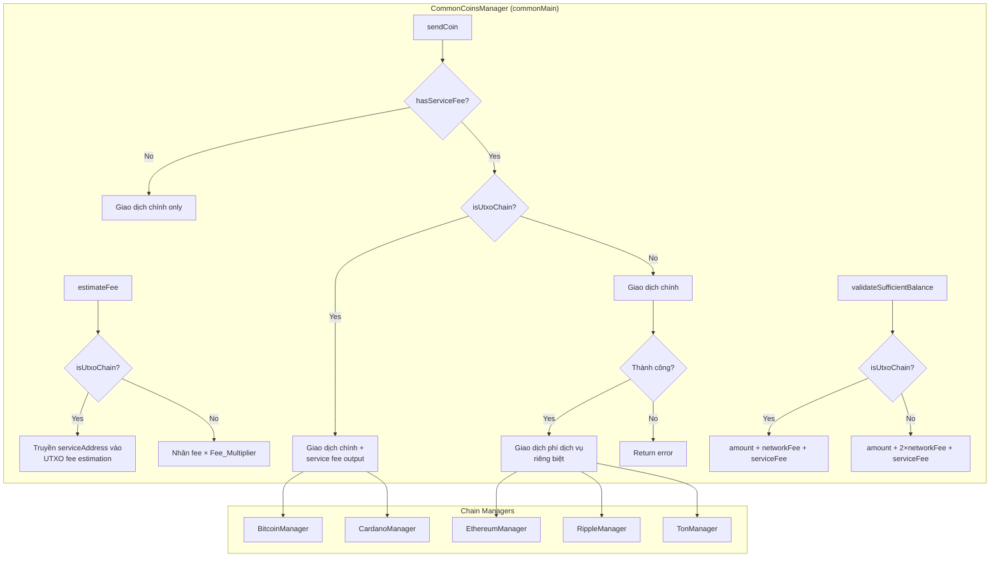
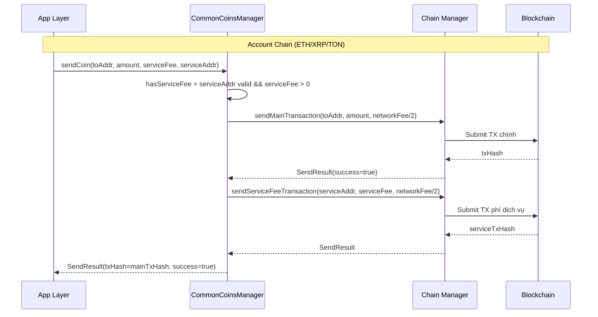

# Tài liệu Thiết kế — Hỗ trợ Phí Dịch Vụ (Service Fee) cho CommonCoinsManager

## Tổng quan

Tài liệu này mô tả thiết kế kỹ thuật để bổ sung hỗ trợ phí dịch vụ (service fee) vào `CommonCoinsManager` trong `commonMain`. Hiện tại, `CoinsManager` (androidMain) đã có chức năng này — thiết kế này đưa logic tương đương vào tầng `commonMain` để tất cả platform (Android, iOS) đều sử dụng chung một codebase.

Phí dịch vụ là khoản phí bổ sung thu từ người dùng trên mỗi giao dịch, được gửi đến địa chỉ ví dịch vụ (Service Address) cấu hình từ Backend. Cơ chế xử lý khác nhau tùy theo kiến trúc blockchain:

- **UTXO chains** (Bitcoin, Cardano): phí dịch vụ được gộp làm output bổ sung trong cùng giao dịch
- **Account chains** (Ethereum, Arbitrum, Ripple, TON): phí dịch vụ là giao dịch riêng biệt, phí mạng lưới được nhân đôi khi ước tính

### Quyết định thiết kế chính

1. **Tương thích ngược**: Tất cả thay đổi sử dụng tham số mặc định, không phá vỡ API hiện tại
2. **Chain-type dispatch**: Sử dụng helper function `isUtxoChain()` để phân loại chain và áp dụng logic phù hợp
3. **Fail-safe cho service fee**: Giao dịch chính luôn được ưu tiên — nếu giao dịch phí dịch vụ thất bại, giao dịch chính vẫn thành công
4. **Tái sử dụng chain managers**: Không tạo manager mới, sử dụng lại `getOrCreateManager()` hiện có

## Kiến trúc

### Sơ đồ kiến trúc tổng quan



### Luồng xử lý Service Fee



## Thành phần và Giao diện

### 1. Helper Functions (mới)

```kotlin
/**
 * Xác định chain có phải UTXO-based không.
 */
private fun isUtxoChain(coin: NetworkName): Boolean {
    return coin in setOf(NetworkName.BTC, NetworkName.CARDANO)
}

/**
 * Xác định có phí dịch vụ hay không.
 */
private fun hasServiceFee(serviceAddress: String?, serviceFee: Double): Boolean {
    return !serviceAddress.isNullOrBlank() && serviceFee > 0.0
}
```

### 2. Mở rộng `estimateFee` (sửa đổi)

Hàm `estimateFee` hiện tại sẽ được bổ sung 2 tham số mới với giá trị mặc định:

```kotlin
suspend fun estimateFee(
    coin: NetworkName,
    amount: Double = 0.0,
    fromAddress: String? = null,
    toAddress: String? = null,
    serviceAddress: String? = null,    // MỚI
    serviceFee: Double = 0.0           // MỚI
): FeeEstimateResult
```

**Logic bổ sung:**
- Nếu `hasServiceFee == false`: giữ nguyên hành vi hiện tại
- Nếu `hasServiceFee == true` và `isUtxoChain`: truyền `serviceAddress` vào chain manager để tính thêm output
- Nếu `hasServiceFee == true` và Account chain: nhân kết quả fee × 2 (Fee_Multiplier)

### 3. Mở rộng `sendCoin` (sửa đổi)

Hàm `sendCoin` đã có tham số `serviceFee` và `serviceAddress` với giá trị mặc định. Logic mới:

**Account Chain flow:**
1. Chia đôi `networkFee` cho mỗi giao dịch
2. Gửi giao dịch chính với `networkFee / 2`
3. Nếu thành công và `hasServiceFee`: gửi giao dịch phí dịch vụ đến `serviceAddress` với `serviceFee` và `networkFee / 2`
4. Nếu giao dịch phí dịch vụ thất bại: log warning, trả về `SendResult` với `txHash` giao dịch chính, `success=true`, `error` chứa thông tin lỗi

**UTXO Chain flow:**
1. Truyền `serviceAddress` và `serviceFee` vào chain manager
2. Chain manager tự thêm output bổ sung trong cùng giao dịch

### 4. Hàm `validateSufficientBalance` (mới)

```kotlin
data class BalanceValidationResult(
    val sufficient: Boolean,
    val totalRequired: Double,
    val deficit: Double = 0.0
)

fun validateSufficientBalance(
    coin: NetworkName,
    amount: Double,
    networkFee: Double,
    serviceFee: Double,
    balance: Double
): BalanceValidationResult
```

**Logic:**
- UTXO chain: `totalRequired = amount + networkFee + serviceFee`
- Account chain: `totalRequired = amount + networkFee + serviceFee` (networkFee đã bao gồm phí cho cả 2 giao dịch từ `estimateFee`)

### 5. Mở rộng Chain Managers

#### BitcoinManager
- `sendBtc` / `sendBtcLocal`: bổ sung tham số `serviceAddress: String?` và `serviceFeeAmount: Long` để thêm output trong UTXO transaction
- `estimateFee` / `estimateFeeLocal`: bổ sung tham số `serviceAddress: String?` để tính thêm output size

#### CardanoManager
- `buildAndSignTransaction`: bổ sung tham số `serviceAddress: String?` và `serviceFeeLovelace: Long` để thêm output
- Fee estimation tự động tính thêm khi có service output

#### EthereumManager
- Không cần thay đổi — `CommonCoinsManager` gọi `sendEth` hai lần (giao dịch chính + giao dịch phí dịch vụ)

#### RippleManager
- Không cần thay đổi — `CommonCoinsManager` gọi `sendXrp` hai lần

#### TonManager
- Không cần thay đổi — `CommonCoinsManager` gọi `signTransaction` + `transfer` hai lần

## Mô hình Dữ liệu

### Data Classes mới

```kotlin
/**
 * Kết quả kiểm tra đủ số dư.
 */
data class BalanceValidationResult(
    val sufficient: Boolean,
    val totalRequired: Double,
    val deficit: Double = 0.0
)
```

### Data Classes hiện có (không thay đổi)

```kotlin
// Đã tồn tại trong CommonCoinsManager
data class FeeEstimateResult(
    val fee: Double,
    val gasLimit: Long? = null,
    val gasPrice: Long? = null,
    val unit: String = "native",
    val success: Boolean,
    val error: String? = null
)

data class SendResult(
    val txHash: String,
    val success: Boolean,
    val error: String? = null
)
```

### Hằng số

```kotlin
companion object {
    /** Hệ số nhân phí mạng lưới cho Account chains khi có service fee */
    const val FEE_MULTIPLIER = 2

    /** Các chain UTXO-based */
    val UTXO_CHAINS = setOf(NetworkName.BTC, NetworkName.CARDANO)
    
    /** Các chain Account-based hỗ trợ service fee */
    val ACCOUNT_CHAINS = setOf(
        NetworkName.ETHEREUM, NetworkName.ARBITRUM, 
        NetworkName.XRP, NetworkName.TON
    )
}
```


## Correctness Properties

*Một property là một đặc tính hoặc hành vi phải luôn đúng trong mọi lần thực thi hợp lệ của hệ thống — về bản chất, đó là một phát biểu hình thức về những gì hệ thống phải làm. Properties đóng vai trò cầu nối giữa đặc tả dễ đọc cho con người và đảm bảo tính đúng đắn có thể kiểm chứng bằng máy.*

### Property 1: Phát hiện hasServiceFee

*For any* giá trị `serviceAddress` là null, chuỗi rỗng, hoặc chuỗi chỉ chứa khoảng trắng, HOẶC `serviceFee` bằng 0.0, hàm `hasServiceFee` phải trả về `false`. Ngược lại, khi `serviceAddress` không rỗng và `serviceFee > 0`, hàm phải trả về `true`.

**Validates: Requirements 5.1, 5.2, 5.3, 2.3, 2.4**

### Property 2: Hệ số nhân phí cho Account Chain

*For any* coin thuộc Account Chain (Ethereum, Arbitrum, Ripple, TON) và bất kỳ `serviceAddress` hợp lệ, kết quả `estimateFee` với service fee phải bằng đúng 2 lần kết quả `estimateFee` không có service fee (cùng tham số khác). Khi `serviceAddress` rỗng/null, kết quả phải bằng đúng kết quả base (hệ số 1).

**Validates: Requirements 1.1, 1.2, 1.3**

### Property 3: UTXO Chain fee estimation với service address

*For any* coin thuộc UTXO Chain (Bitcoin, Cardano) và bất kỳ `serviceAddress` hợp lệ, kết quả `estimateFee` phải lớn hơn hoặc bằng kết quả khi không có service address (vì thêm output tăng kích thước giao dịch).

**Validates: Requirements 1.4**

### Property 4: Account Chain gửi hai giao dịch

*For any* coin thuộc Account Chain với `serviceAddress` hợp lệ và `serviceFee > 0`, khi giao dịch chính thành công, `sendCoin` phải thực hiện đúng 2 giao dịch: giao dịch chính đến `toAddress` với `amount`, và giao dịch phí dịch vụ đến `serviceAddress` với `serviceFee`.

**Validates: Requirements 2.1**

### Property 5: UTXO Chain bao gồm service fee output

*For any* coin thuộc UTXO Chain với `serviceAddress` hợp lệ và `serviceFee > 0`, `sendCoin` phải truyền `serviceAddress` và `serviceFee` vào chain manager để bao gồm như output bổ sung trong cùng giao dịch.

**Validates: Requirements 2.2**

### Property 6: Giao dịch chính thất bại ngăn giao dịch phí dịch vụ

*For any* coin và bất kỳ cấu hình service fee, nếu giao dịch chính thất bại (success=false), `sendCoin` phải trả về `SendResult` với `success=false` và không thực hiện bất kỳ giao dịch phí dịch vụ nào.

**Validates: Requirements 2.5**

### Property 7: Chia đôi phí mạng lưới cho Account Chain

*For any* coin thuộc Account Chain với service fee, khi `sendCoin` thực hiện hai giao dịch, mỗi giao dịch đơn lẻ phải nhận `networkFee / 2` làm phí mạng lưới (tổng hai giao dịch bằng `networkFee` ban đầu).

**Validates: Requirements 3.1, 3.2**

### Property 8: Kiểm tra đủ số dư

*For any* tổ hợp giá trị `amount`, `networkFee`, `serviceFee`, và `balance` (đều >= 0), hàm `validateSufficientBalance` phải trả về `sufficient=true` khi và chỉ khi `totalRequired <= balance`, với `deficit = max(0, totalRequired - balance)` chính xác.

**Validates: Requirements 4.2, 4.3, 4.4**

### Property 9: Giao dịch phí dịch vụ thất bại bảo toàn giao dịch chính

*For any* coin thuộc Account Chain, khi giao dịch chính thành công nhưng giao dịch phí dịch vụ thất bại, `sendCoin` phải trả về `SendResult` với `txHash` của giao dịch chính, `success=true`, và `error` chứa thông tin lỗi giao dịch phí dịch vụ.

**Validates: Requirements 6.1**

### Property 10: Tương thích ngược

*For any* coin và bất kỳ tham số, gọi `estimateFee` và `sendCoin` với giá trị mặc định cho `serviceAddress=null` và `serviceFee=0.0` phải cho kết quả giống hệt khi gọi mà không truyền các tham số mới.

**Validates: Requirements 1.5, 2.6**

## Xử lý Lỗi

### Chiến lược xử lý lỗi

| Tình huống | Hành vi | Kết quả |
|---|---|---|
| Service address không hợp lệ (rỗng/null) | Bỏ qua service fee, chỉ giao dịch chính | `SendResult(success=true/false)` bình thường |
| Service fee = 0 | Bỏ qua service fee, chỉ giao dịch chính | `SendResult(success=true/false)` bình thường |
| Giao dịch chính thất bại | Không gửi giao dịch phí dịch vụ | `SendResult(success=false, error=...)` |
| Giao dịch phí dịch vụ thất bại (Account chain) | Log warning, trả về txHash giao dịch chính | `SendResult(txHash=mainTx, success=true, error="Service fee failed: ...")` |
| Không đủ số dư | `validateSufficientBalance` trả về `sufficient=false` | `BalanceValidationResult(sufficient=false, deficit=X)` |
| Chain không hỗ trợ | Trả về lỗi | `SendResult(success=false, error="Not supported")` |

### Nguyên tắc

1. **Giao dịch chính luôn ưu tiên**: Không bao giờ rollback giao dịch chính vì lỗi phí dịch vụ
2. **Fail-safe**: Mọi lỗi liên quan đến service fee đều được catch và log, không throw exception
3. **Thông tin đầy đủ**: `SendResult.error` luôn chứa thông tin chi tiết khi có lỗi phí dịch vụ

## Chiến lược Kiểm thử

### Phương pháp kiểm thử kép

Sử dụng kết hợp **unit tests** và **property-based tests** để đảm bảo coverage toàn diện:

- **Unit tests**: Kiểm tra các ví dụ cụ thể, edge cases, và error conditions
- **Property tests**: Kiểm tra các thuộc tính phổ quát trên mọi input

### Property-Based Testing

- **Thư viện**: [kotlin-test](https://kotlinlang.org/api/latest/kotlin.test/) kết hợp với [Kotest Property Testing](https://kotest.io/docs/proptest/property-based-testing.html) (`io.kotest:kotest-property`)
- **Cấu hình**: Mỗi property test chạy tối thiểu 100 iterations
- **Tag format**: `Feature: service-fee-support, Property {number}: {property_text}`
- **Mỗi correctness property phải được implement bởi MỘT property-based test duy nhất**

### Generators cần thiết

- `Arb.networkName()`: sinh ngẫu nhiên `NetworkName` từ các chain được hỗ trợ
- `Arb.accountChain()`: sinh ngẫu nhiên Account chain (ETH, Arbitrum, XRP, TON)
- `Arb.utxoChain()`: sinh ngẫu nhiên UTXO chain (BTC, Cardano)
- `Arb.serviceAddress()`: sinh ngẫu nhiên service address (bao gồm null, rỗng, hợp lệ)
- `Arb.positiveDouble()`: sinh số dương cho amount, fee, balance

### Unit Tests

Unit tests tập trung vào:
- Ví dụ cụ thể cho từng chain (BTC, ETH, XRP, TON, Cardano)
- Edge cases: serviceFee = 0, serviceAddress = "", balance vừa đủ, balance thiếu 1 satoshi
- Integration: verify chain manager nhận đúng tham số
- Error conditions: chain manager throw exception, network timeout

### Cấu trúc test files

```
crypto-wallet-lib/src/commonTest/kotlin/com/lybia/cryptowallet/coinkits/
├── ServiceFeePropertyTest.kt      // Property-based tests cho 10 properties
├── ServiceFeeUnitTest.kt          // Unit tests cho edge cases và examples
└── BalanceValidationTest.kt       // Tests cho validateSufficientBalance
```
