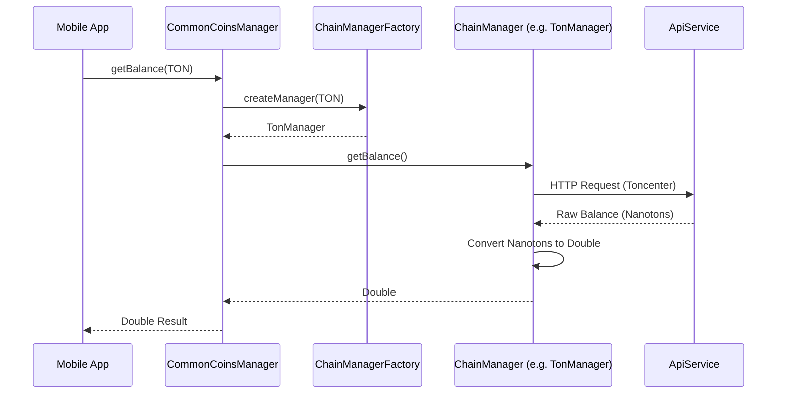

# Chi tiết API: CommonCoinsManager

`CommonCoinsManager` là facade chính trong `commonMain`, cung cấp giao diện lập trình thống nhất cho tất cả các blockchain.

## 1. Khởi tạo (Constructor)

| Tham số | Kiểu dữ liệu | Mô tả |
| :--- | :--- | :--- |
| `mnemonic` | `String` | Chuỗi 12 hoặc 24 từ khóa bí mật. |
| `configs` | `Map<NetworkName, ChainConfig>` | (Tùy chọn) Cấu hình API URL hoặc API Key cho từng chain. |

## 2. Các hàm thành viên (Functions)

### 2.1. getAddress
Lấy địa chỉ ví mặc định cho một loại coin.
- **Input:** `coin: NetworkName`
- **Output:** `String` (Địa chỉ ví)
- **Flow:** Derived từ Mnemonic theo chuẩn BIP44.

### 2.2. getBalance
Lấy số dư khả dụng.
- **Input:** 
    - `coin: NetworkName`
    - `address: String?` (Mặc định là null, sẽ lấy địa chỉ của mnemonic)
- **Output:** `suspend Double`
- **Error:** Ném ra `WalletError.ConnectionError` nếu không có mạng.

### 2.3. transfer
Gửi tiền đến một địa chỉ khác.
- **Input:**
    - `coin: NetworkName`
    - `toAddress: String`
    - `amount: Double`
    - `fee: Double`
- **Output:** `suspend TransferResponseModel` (Chứa `txHash`)

### 2.4. getTokenBalance
Lấy số dư của Token (ERC-20, Jetton, Native Token).
- **Input:**
    - `coin: NetworkName`
    - `address: String`
    - `contractAddress: String`
- **Output:** `suspend Double`

## 3. Sơ đồ tuần tự (Sequence Diagram - Get Balance)

