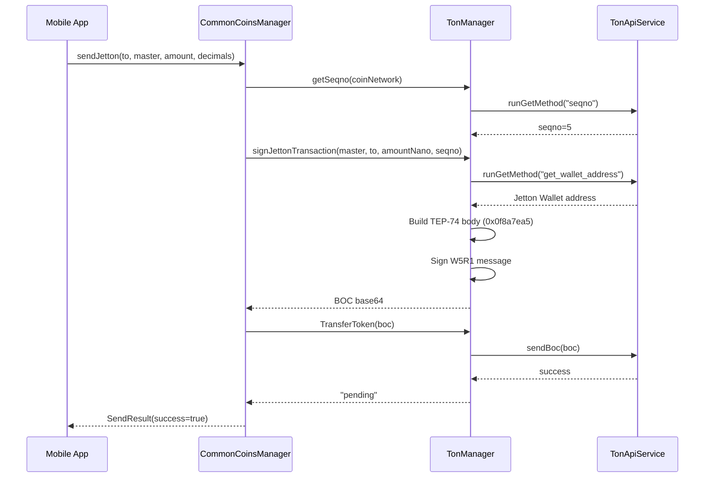

# Chi tiết API: CommonCoinsManager

`CommonCoinsManager` là facade chính trong `commonMain`, cung cấp giao diện lập trình thống nhất cho tất cả các blockchain.

## 1. Khởi tạo (Constructor)

| Tham số | Kiểu dữ liệu | Mô tả |
| :--- | :--- | :--- |
| `mnemonic` | `String` | Chuỗi 12 hoặc 24 từ khóa bí mật. |
| `configs` | `Map<NetworkName, ChainConfig>` | (Tùy chọn) Cấu hình API URL hoặc API Key cho từng chain. |

### Singleton Pattern
```kotlin
// App startup
CommonCoinsManager.initialize("your mnemonic here")

// Anywhere in the app
val address = CommonCoinsManager.shared.getAddress(NetworkName.TON)

// Logout / switch wallet
CommonCoinsManager.reset()
```

## 2. Các hàm thành viên (Functions)

### 2.1. getAddress
Lấy địa chỉ ví mặc định cho một loại coin.
- **Input:** `coin: NetworkName`
- **Output:** `String` (Địa chỉ ví)
- **Flow:** Derived từ Mnemonic theo chuẩn BIP44 (hoặc SLIP-0010 cho TON).

### 2.2. getBalance
Lấy số dư khả dụng.
- **Input:** 
    - `coin: NetworkName`
    - `address: String?` (Mặc định là null, sẽ lấy địa chỉ của mnemonic)
- **Output:** `suspend BalanceResult`
- **Error:** Ném ra `WalletError.ConnectionError` nếu không có mạng.

### 2.3. transfer
Gửi tiền đến một địa chỉ khác (với BOC/signed data đã ký sẵn).
- **Input:**
    - `coin: NetworkName`
    - `dataSigned: String` (Pre-signed transaction)
- **Output:** `suspend SendResult`

### 2.4. sendCoin
Gửi coin trực tiếp — tự động ký + broadcast.
- **Input:**
    - `coin: NetworkName`
    - `toAddress: String`
    - `amount: Double`
    - `memo: MemoData?` (Tùy chọn)
    - `serviceAddress: String?` (Tùy chọn, cho service fee)
    - `serviceFee: Double` (Mặc định 0)
- **Output:** `suspend SendResult`
- **Service fee:** Account chains (ETH, TON, XRP) gửi transaction riêng. UTXO chains (BTC, Cardano) thêm output trong cùng transaction.

### 2.5. sendCoinExact
Gửi coin với amount ở đơn vị nhỏ nhất (nanoTON, satoshi, lovelace).
- **Input:**
    - `coin: NetworkName`
    - `toAddress: String`
    - `amountSmallestUnit: Long`
    - `feeSmallestUnit: Long` (Mặc định 0)
    - `memo: MemoData?`
- **Output:** `suspend SendResult`

### 2.6. getTransactionHistory
Lấy lịch sử giao dịch (không phân trang).
- **Input:**
    - `coin: NetworkName`
    - `address: String?` (Mặc định là null)
- **Output:** `suspend Any?` (Kiểu trả về phụ thuộc vào từng chain)

### 2.7. getTransactionHistoryPaginated
Lấy lịch sử giao dịch có hỗ trợ phân trang.
- **Input:**
    - `coin: NetworkName`
    - `address: String?` (Mặc định là null)
    - `limit: Int` (Mặc định 100)
    - `pageParam: Map<String, Any?>?` (Tham số phân trang từ lần gọi trước, null cho lần đầu)
- **Output:** `suspend TransactionHistoryResult`
    - `transactions: Any?` — Danh sách giao dịch
    - `hasMore: Boolean` — Còn trang tiếp theo hay không
    - `nextPageParam: Map<String, Any?>?` — Tham số để gọi trang tiếp theo
    - `success: Boolean`
    - `error: String?`

**Hỗ trợ phân trang theo chain:**

| Chain | Pagination | pageParam | Ghi chú |
| :--- | :--- | :--- | :--- |
| Ripple (XRP) | ✅ Marker-based | `{"ledger": Long, "seq": Long}` | Limit mặc định 100 |
| Centrality | ✅ Page-based | `{"page": Int}` | Row mặc định 100 |
| Cardano | ✅ Page-based | `{"page": Int}` (1-based) | Blockfrost `count`/`page`/`order`, max 100/page |
| **TON** | ✅ Cursor-based | `{"lt": String, "hash": String}` | Logical time + hash cursor |
| **Ethereum** | ✅ Page-based | `{"page": Int}` (1-based) | Etherscan `page`/`offset`, max 10000/page |
| **Arbitrum** | ✅ Page-based | `{"page": Int}` (1-based) | Arbiscan `page`/`offset`, max 10000/page |
| Bitcoin | ❌ | — | Trả về tất cả |
| Midnight | ❌ | — | Trả về tất cả |

### 2.8. getTokenBalance
Lấy số dư của Token (ERC-20, Jetton, Native Token).
- **Input:**
    - `coin: NetworkName`
    - `address: String`
    - `contractAddress: String`
- **Output:** `suspend BalanceResult`
- **TON:** Gọi `ITokenManager.getTokenBalance()` → `TonManager.getBalanceToken()` với decimals mặc định 9. Muốn đúng decimals, dùng `getJettonMetadata()` trước.

### 2.9. getTokenTransactionHistoryPaginated
Lấy lịch sử giao dịch của token có phân trang.
- **Input:**
    - `coin: NetworkName`
    - `policyId: String` — Policy ID (Cardano) hoặc Jetton Master address (TON)
    - `assetName: String` — Asset name hex (Cardano) hoặc bỏ trống (TON)
    - `limit: Int` (Mặc định 20, tối đa 100)
    - `pageParam: Map<String, Any?>?` (null cho lần đầu)
- **Output:** `suspend TransactionHistoryResult`
- **Cardano:** Blockfrost `/assets/{policyId}{assetName}/transactions`
- **TON:** Parsed Jetton transactions với opcodes (send/receive/burn). `policyId` = Jetton Master address. `pageParam = {"lt": String, "hash": String}`

### 2.10. sendToken
Gửi token đã ký sẵn.
- **Input:** `coin: NetworkName`, `dataSigned: String`
- **Output:** `suspend SendResult`

## 3. NFT Operations

### 3.1. getNFTs
Lấy danh sách NFT của một địa chỉ.
- **Input:** `coin: NetworkName`, `address: String`
- **Output:** `suspend List<NFTItem>?`
- **Hỗ trợ:** Ethereum, Arbitrum, TON

### 3.2. transferNFT
Transfer NFT.
- **Input:** `coin: NetworkName`, `nftAddress: String`, `toAddress: String`, `memo: String?`
- **Output:** `suspend SendResult`
- **TON:** Tự động ký + broadcast (seqno → signNFTTransfer → sendBoc).

## 4. Staking Operations

### 4.1. stake
Stake/delegate cho pool.
- **Input:** `coin: NetworkName`, `amount: Long`, `poolAddress: String`
- **Output:** `suspend SendResult`
- **TON:** Tự động detect pool type → gọi đúng method (Nominator/Tonstakers/Bemo).

### 4.2. unstake
Unstake/undelegate.
- **Input:** `coin: NetworkName`, `amount: Long`, `poolAddress: String?` (null cho Cardano)
- **Output:** `suspend SendResult`
- **TON:** `poolAddress` **bắt buộc** cho Tonstakers/Bemo (burn staking tokens). Nominator pools tự xử lý withdrawal.
- **Cardano:** `poolAddress` không cần, truyền null.

### 4.3. getStakingBalance
Lấy số dư staking.
- **Input:** `coin: NetworkName`, `address: String?`, `poolAddress: String`
- **Output:** `suspend BalanceResult`

### 4.4. getStakingRewards
Lấy rewards.
- **Input:** `coin: NetworkName`, `address: String?`
- **Output:** `suspend BalanceResult`
- **TON:** Trả về 0.0 — rewards được tính chung trong `getStakingBalance`.

## 5. TON-Specific Operations

Các method chỉ dành cho TON, expose qua CommonCoinsManager:

### 5.1. sendJetton
Gửi Jetton token trực tiếp — ký + broadcast tự động.
```kotlin
suspend fun sendJetton(
    toAddress: String,
    jettonMasterAddress: String,
    amount: Double,
    decimals: Int = 9,      // USDT=6, default=9
    memo: String? = null
): SendResult
```
**Ưu điểm so với sendToken:** Không cần ký riêng, tự động lấy seqno + sign + broadcast.

### 5.2. getJettonMetadata
Lấy metadata token Jetton.
```kotlin
suspend fun getJettonMetadata(contractAddress: String): JettonMetadata?
// Returns: name, symbol, decimals, description, image
```

### 5.3. resolveTonDns
Resolve TON DNS domain → address.
```kotlin
suspend fun resolveTonDns(domain: String): String?
// "alice.ton" → "UQ..."
```

### 5.4. reverseResolveTonDns
Reverse resolve address → domain.
```kotlin
suspend fun reverseResolveTonDns(address: String): String?
// "UQ..." → "alice.ton"
```

### 5.5. detectTonPoolType
Detect loại staking pool TON.
```kotlin
suspend fun detectTonPoolType(poolAddress: String): TonPoolType
// Returns: NOMINATOR, TONSTAKERS, BEMO, UNKNOWN
```

## 6. Bridge Operations

### 6.1. bridgeAsset
Bridge asset giữa 2 chain.
- **Input:** `fromChain`, `toChain`, `amount: Long`
- **Output:** `suspend SendResult`

### 6.2. getBridgeStatus
Query trạng thái bridge transaction.
- **Input:** `txHash: String`
- **Output:** `suspend String`

## 7. Fee Estimation

### 7.1. estimateFee
Ước tính phí giao dịch.
- **Input:** `coin`, `amount`, `fromAddress?`, `toAddress?`, `serviceAddress?`, `serviceFee`
- **Output:** `suspend FeeEstimateResult`
- **TON:** Tạo dummy BOC để estimate qua `estimateFee` RPC.

## 8. Capability Checking

| Method | Chains hỗ trợ |
|--------|--------------|
| `supportsTokens(coin)` | Ethereum, Arbitrum, Cardano, **TON** |
| `supportsNFTs(coin)` | Ethereum, Arbitrum, **TON** |
| `supportsStaking(coin)` | Cardano, **TON** |
| `supportsFeeEstimation(coin)` | Ethereum, Arbitrum |
| `supportsBridge(from, to)` | Cardano↔Midnight, Ethereum↔Arbitrum |

## 9. Sơ đồ tuần tự (Sequence Diagram - Get Balance)


## 10. Sơ đồ: Send Jetton (TON Token)



## 11. Design Patterns & Conventions

Khi review code hoặc refactor bất kỳ chain nào, cần tuân thủ các pattern sau:

### 11.1. Interface Hierarchy
Mỗi chain manager **phải** implement đúng interfaces:

| Interface | Bắt buộc | Mô tả |
|-----------|----------|-------|
| `BaseCoinManager` / `IWalletManager` | ✅ | getAddress, getBalance, getTransactionHistory, transfer, getChainId |
| `ITokenManager` | Nếu chain hỗ trợ token | getTokenBalance, getTokenTransactionHistory, transferToken |
| `ITokenAndNFT` | Legacy (TON, Ethereum) | getBalanceToken, getTransactionHistoryToken, TransferToken |
| `INFTManager` | Nếu chain hỗ trợ NFT | getNFTs, transferNFT |
| `IStakingManager` | Nếu chain hỗ trợ staking | stake, unstake, getStakingRewards, getStakingBalance |
| `IFeeEstimator` | Nếu chain hỗ trợ fee estimate | estimateFee |
| `IBridgeManager` | Nếu chain hỗ trợ bridge | bridgeAsset, getBridgeStatus |

> **Quan trọng:** Nếu chain hỗ trợ token, phải implement **cả** `ITokenManager` lẫn `ITokenAndNFT` (nếu dùng legacy pattern). `CommonCoinsManager` cast sang `ITokenManager`, không phải `ITokenAndNFT`.

### 11.2. ChainManagerFactory Registration
Mỗi chain mới phải được đăng ký trong `ChainManagerFactory.createWalletManager()`:
```kotlin
NetworkName.NEW_CHAIN -> NewChainManager(mnemonic)
```

### 11.3. CommonCoinsManager Routing
Khi thêm chain-specific logic, thêm `when` branch vào đúng method:
- `sendCoin()` — per-chain signing + broadcast
- `sendCoinExact()` — per-chain smallest unit handling
- `getTransactionHistoryPaginated()` — per-chain pagination
- `estimateFee()` — per-chain fee estimation

### 11.4. Result Wrapper Pattern
Mọi public method trong CommonCoinsManager phải:
- Return result wrapper (`BalanceResult`, `SendResult`, `TransactionHistoryResult`)
- Wrap trong `try-catch` → trả về `success = false, error = message`
- **Không throw exception** ra ngoài

### 11.5. Config Singleton
- `Config.shared.setNetwork()` thay đổi tất cả endpoints
- Chain managers đọc `Config.shared` at runtime, không nhận network ở constructor
- `CoinNetwork(name)` chỉ wrap `NetworkName`, không mang state

### 11.6. Coroutine Convention
- `CommonCoinsManager` methods đều là `suspend fun`
- Android bridge (`TonService`, `CoinsManager`) dùng `scope.launch { ... withContext(Dispatchers.Main) { callback } }`
- Không dùng `GlobalScope`

### 11.7. Smallest Unit Convention
| Chain | Unit | Factor |
|-------|------|--------|
| Bitcoin | satoshi | 100,000,000 |
| Ethereum | wei | 1,000,000,000,000,000,000 |
| TON | nanoTON | 1,000,000,000 |
| Cardano | lovelace | 1,000,000 |
| Ripple | drops | 1,000,000 |
| Centrality | — | 10,000 |

### 11.8. Checklist khi thêm/refactor chain

- [ ] Implement đủ interfaces (IWalletManager + ITokenManager/INFTManager/IStakingManager nếu cần)
- [ ] Đăng ký trong `ChainManagerFactory`
- [ ] Thêm routing trong `CommonCoinsManager` (sendCoin, estimateFee, pagination)
- [ ] Cập nhật `supportsTokens()` / `supportsNFTs()` / `supportsStaking()`
- [ ] Add `when` branch cho chain-specific logic
- [ ] Wrap tất cả method trong try-catch, return result wrapper
- [ ] Unit test cho address derivation
- [ ] Integration test cho API calls (MockEngine)
- [ ] Cập nhật docs: `docs/chains/{chain}.md` + `docs/api/common-coins-manager.md`
